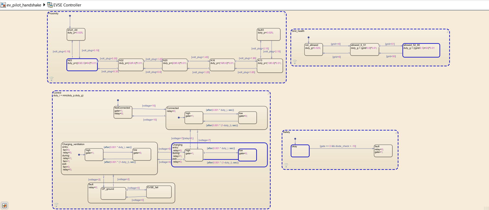
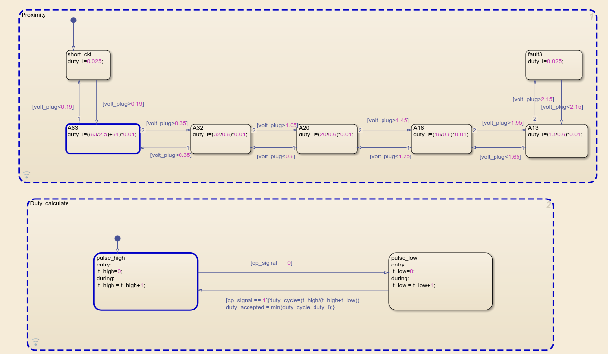
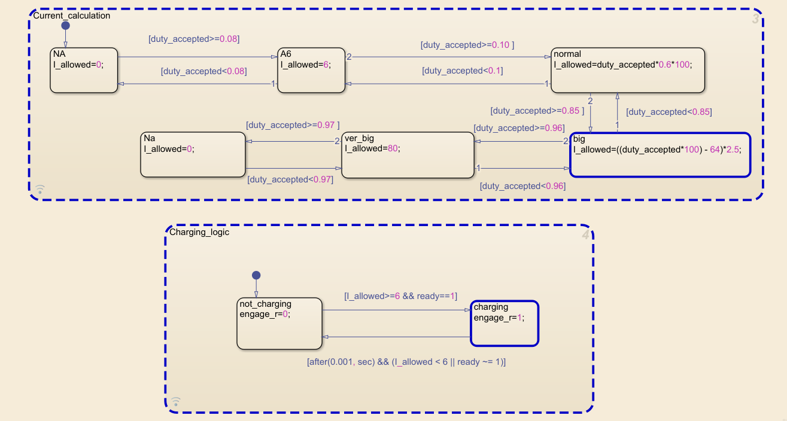

# IEC 61851-1 EV Charging Station Simulation (Simulink/Stateflow)


 

A high-fidelity "Digital Twin" simulation of an Electric Vehicle Supply Equipment (EVSE) and Electric Vehicle (EV) charging handshake, designed according to **IEC 61851-1** standard. 

This project models the complete physical layer and communication protocol, including Safety Logic, Proximity Detection, and Dynamic Grid Load Balancing.

[](https://www.youtube.com/watch?v=m4KEkTv8oNk)
*Figure 1: Video Demonstration of the Complete System Model (Click the image to play).*

## 🔋 Project Overview
The simulation demonstrates the full charging sequence (States A through C), fault handling, and current negotiation. It addresses complex simulation challenges such as **Algebraic Loops** in feedback systems and **High-Precision PWM Duty Cycle Decoding** for communication.

### Key Features
* **🔌 Protocol Compliance:** Full implementation of IEC 61851 Control Pilot (CP) and Proximity Pilot (PP) circuits.
* **🧠 Smart Grid Integration:** EVSE dynamically adjusts PWM duty cycle based on real-time **Grid Capacity** (e.g., lowering charging speed during peak load).
* **🛡️ Advanced Safety Logic:**
    * **Diode Check:** Detects "Missing Diode" faults by monitoring the -12V negative PWM cycle.
    * **Cable Protection:** "Weakest Link" logic ensures current never exceeds the cable's physical rating.
    * **State Monitoring:** Hysteresis-based switching to prevent contactor chatter.
* **⏱️ Precision Timing:** Custom Stateflow logic to decode 1kHz PWM signals with **0.1% accuracy** ($1\mu s$ sample time).

## 🛠️ Technical Implementation

### 1. The EVSE Controller (Charger)
The charger controller manages the handshake and grid limits. It uses a **Track-and-Hold** mechanism to filter the 1kHz Pilot signal without creating algebraic loops in Simulink.



* **Grid_Health:** Monitors external grid capacity (Amps) and maps it to the allowed Duty Cycle.
* **Safety_Check:** Continuously verifies the integrity of the ground connection and vehicle circuitry.

### 2. The EV Controller (Vehicle)
The vehicle logic decodes the incoming signal and determines the final charging current (I_max).

`I_max = min(I_Grid_Available, I_Cable_Rating)`




* **Duty Cycle Decoder:** Measures T_on and T_period to calculate available grid power.
* **Current_Calculation:** Implements the IEC 61851 mapping formula:
  * For 10% to 85% Duty Cycle: `I = D * 0.6`
  * For 85% to 96% Duty Cycle: `I = (D - 64) * 2.5`

## 🚀 How to Run
1.  **Requirements:** MATLAB R2023b (or newer), Simulink, Simscape Electrical, Stateflow.
2.  Clone the repository:
    ```bash
    git clone [https://github.com/shakebs/EV-Charging-Handshake-IEC-61851.git](https://github.com/shakebs/EV-Charging-Handshake-IEC-61851.git)
    ```
3.  Open `ev_pilot_handshake.slx`.
4.  Run the simulation.
5.  Use the **Dashboard Switches** to simulate:
    * Plugging in the cable (shift switch to connect).
    * Changing Grid Capacity.
    * Triggering Safety Faults (Diode fail, Cable disconnect).

## 📊 Results
The scope below shows a successful charging session:
1.  **T=0s:** State A (12V) - Unplugged.
2.  **T=0.015s:** State B (9V) - Plugged in, Pilot signal starts (Current allowed 32A).
3.  **T=0.035s:** State C (6V) - Vehicle closes switch1, charging begins.
4.  **T=0.052s:** Grid capacity drops; EVSE lowers PWM duty cycle, Vehicle reduces current draw instantly.


## 📂 Repository Structure
* `models/`: Contains the `.slx` simulation files.
* `scripts/`: MATLAB initialization scripts (variables, constants).
* `images/`: Screenshots for documentation.
* `docs/`: State transition diagrams and logic flowcharts.

## 🤝 Contributing
Open to discussions on implementing **ISO 15118 (Plug & Charge)** or **V2G (Vehicle-to-Grid)** features.

**Author**
* **Shakeb Sarwar** - *Final Year Electrical Engineering, RGIPT*
* [Connect with me on LinkedIn](https://www.linkedin.com/in/shakeb-sarwar)